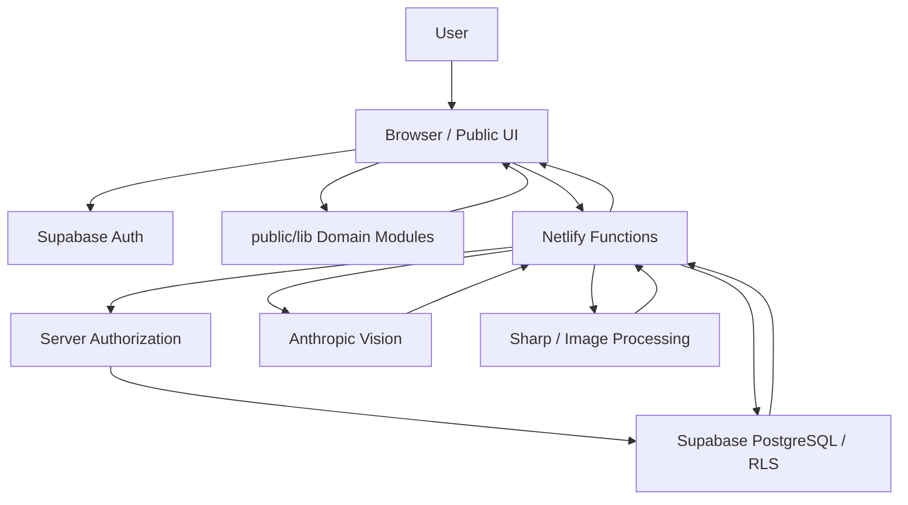
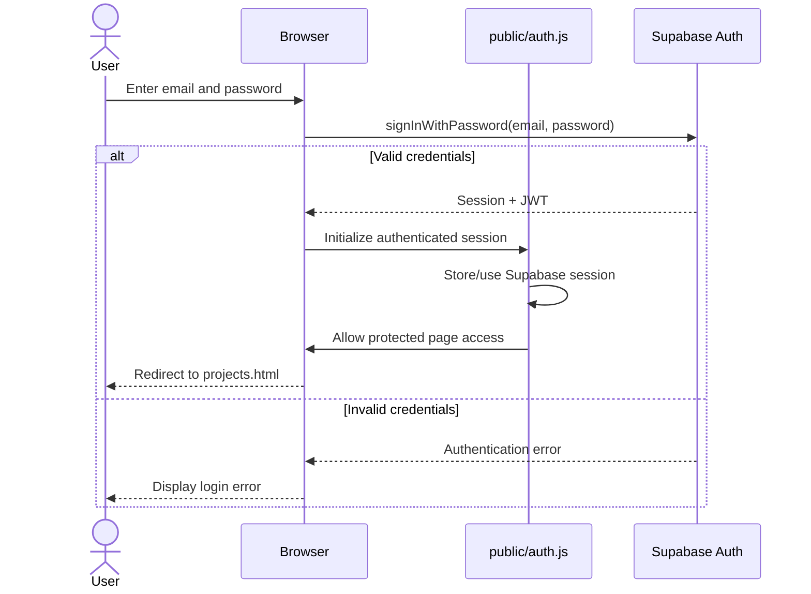
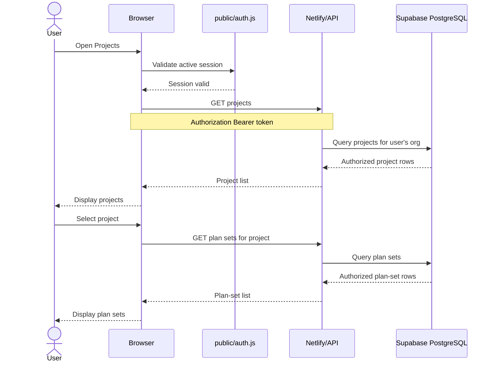
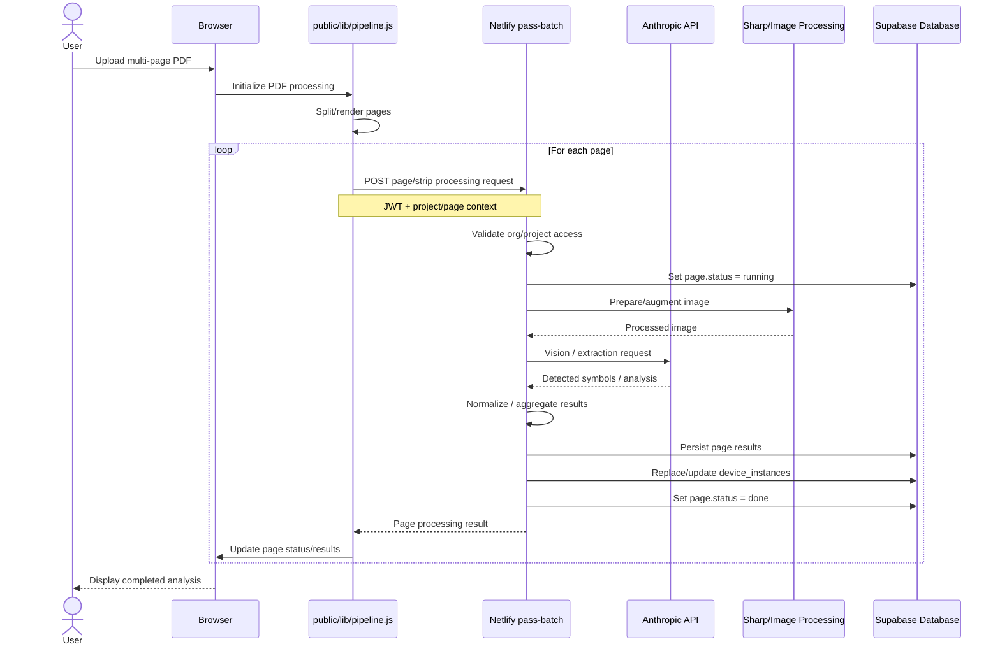
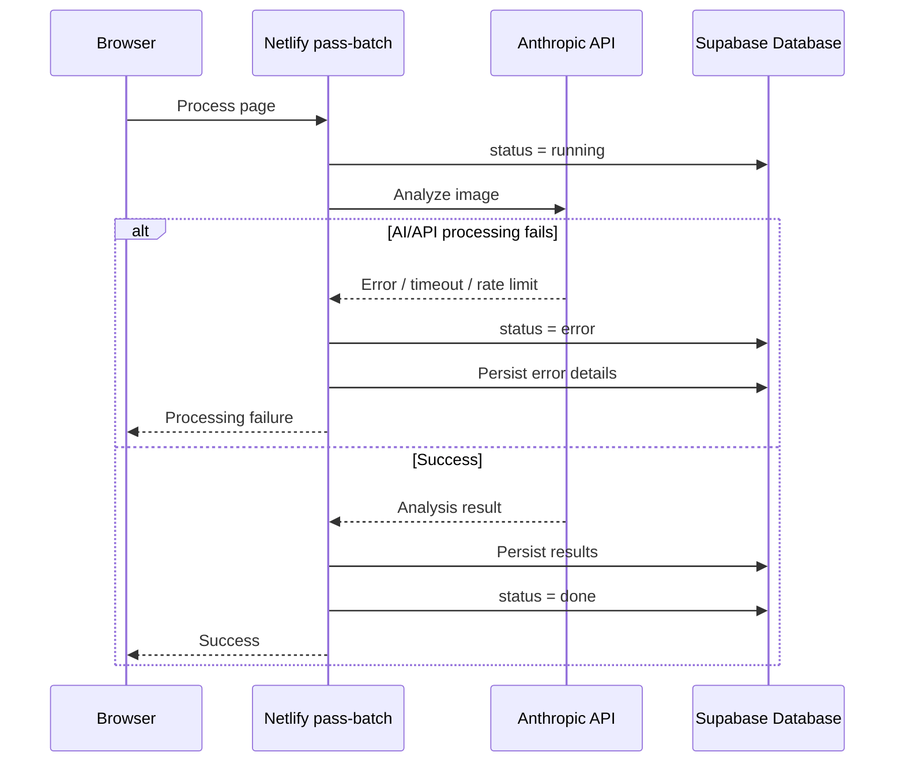
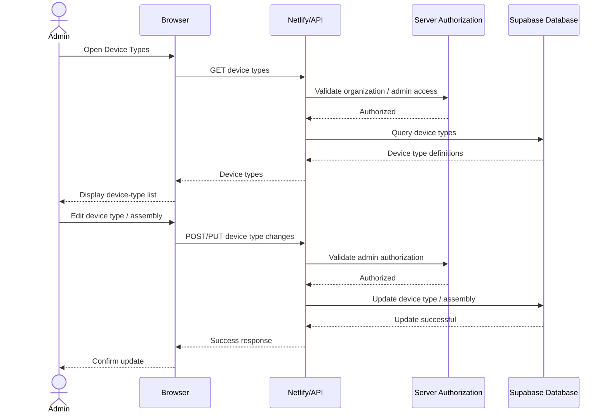
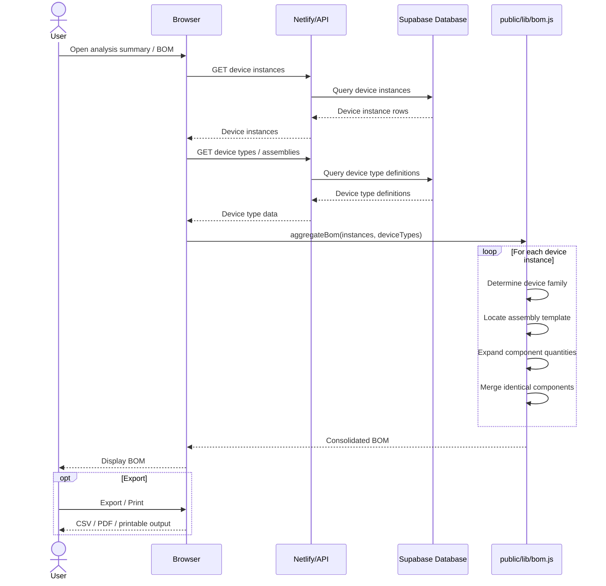
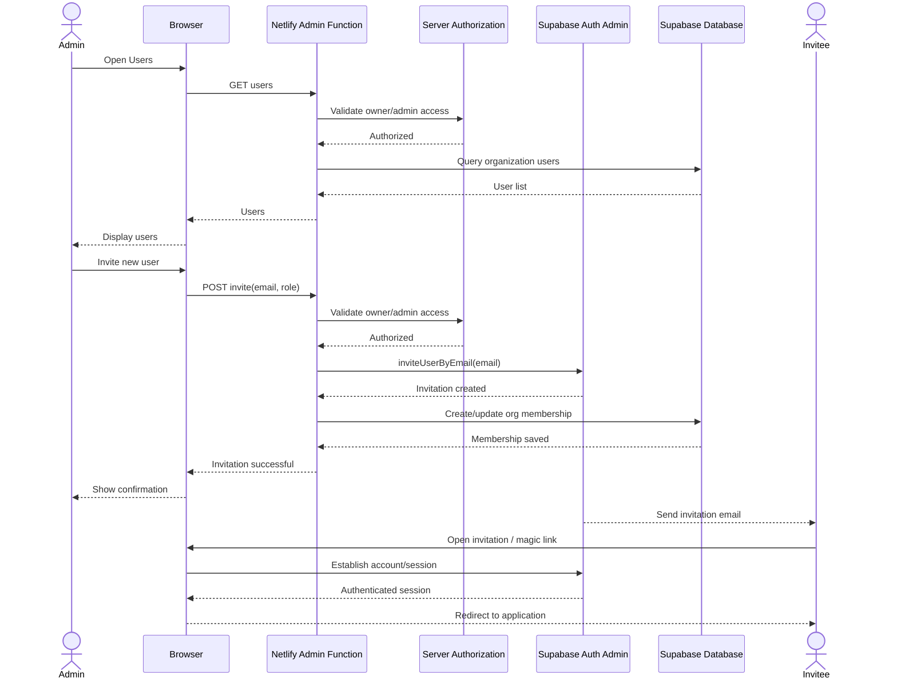

# Take-Off Architecture

## 1. Overall Architecture

Take-Off is a web-based schematic drawing take-off application built with a serverless architecture.

The system is composed of three primary layers:

1. **Browser / Client Layer**
2. **Netlify Functions / Server Layer**
3. **Supabase + External Services**

---

## High-Level System Architecture

**Take-Off is a browser-based serverless application where the UI orchestrates workflows, Netlify Functions perform protected server-side processing and AI/image analysis, and Supabase provides authentication, multi-tenant data storage, and authorization through RLS.**

#### Overall Architecture Summary:



---


```text
┌──────────────────────────────────────────────────────────────────────┐
│                         Browser / Client Layer                       │
│                                                                      │
│  ┌────────────────────────────────────────────────────────────────┐  │
│  │ public/*.html                                                  │  │
│  │                                                                │  │
│  │ Projects                                                       │  │
│  │ Plan Sets                                                      │  │
│  │ Device Types                                                   │  │
│  │ Multi-Page PDF Processing                                     │  │
│  │ Users                                                          │  │
│  │ Authentication                                                 │  │
│  └────────────────────────────────────────────────────────────────┘  │
│                                                                      │
│  ┌────────────────────────────────────────────────────────────────┐  │
│  │ public/lib/*.js                                                │  │
│  │                                                                │  │
│  │ Core business logic                                            │  │
│  │ BOM calculations                                               │  │
│  │ Geometry                                                       │  │
│  │ Device discovery                                               │  │
│  │ Classification                                                 │  │
│  │ Reconciliation                                                 │  │
│  │ Processing pipeline                                            │  │
│  └────────────────────────────────────────────────────────────────┘  │
│                                                                      │
│  ┌────────────────────────────────────────────────────────────────┐  │
│  │ public/tools/*.js                                              │  │
│  │                                                                │  │
│  │ Specialized processing modules                                │  │
│  └────────────────────────────────────────────────────────────────┘  │
│                                                                      │
│  Authentication                                                     │
│  ├── public/auth.js                                                  │
│  ├── public/login.html                                               │
│  └── Supabase Auth Client                                            │
│                                                                      │
└───────────────────────────────┬──────────────────────────────────────┘
                                │
                                │ Fetch API
                                │ Authorization: Bearer <JWT>
                                ▼
┌──────────────────────────────────────────────────────────────────────┐
│                       Netlify Functions Layer                        │
│                                                                      │
│  netlify/functions/                                                  │
│                                                                      │
│  ├── pass-batch.js                                                   │
│  ├── pass-symbol                                                     │
│  ├── pass-discover.js                                                │
│  ├── pass-extract.js                                                 │
│  ├── pass-describe.js                                                │
│  ├── pass-visual-augment.js                                          │
│  └── other API / processing functions                               │
│                                                                      │
│  Responsibilities                                                    │
│  ├── API routing                                                     │
│  ├── Server-side authorization                                      │
│  ├── AI / vision processing                                         │
│  ├── Image processing                                                │
│  ├── Database writes                                                 │
│  └── Long-running page processing                                   │
│                                                                      │
└───────────────────────┬───────────────────────┬──────────────────────┘
                        │                       │
                        │                       │
                        ▼                       ▼
┌───────────────────────────────┐   ┌─────────────────────────────────┐
│           Supabase            │   │        External Services        │
│                               │   │                                 │
│  Authentication               │   │  Anthropic API / Vision         │
│  PostgreSQL                   │   │                                 │
│  Row Level Security           │   │  PDF.js                         │
│                               │   │                                 │
│  Users                        │   │  Sharp                           │
│  Organizations                │   │                                 │
│  Projects                     │   │  Image-processing utilities     │
│  Plan Sets                    │   │                                 │
│  Pages                        │   └─────────────────────────────────┘
│  Device Types                 │
│  Device Instances             │
│  Analysis Results             │
│                               │
└───────────────────────────────┘
```

---

# 2. Main Architectural Responsibilities

## Browser / Client

The browser is responsible for:

- User interaction
- Authentication/session handling
- Page-level UI state
- Project and plan-set navigation
- PDF upload and page workflow initiation
- Calling reusable domain modules
- Orchestrating multi-page processing
- Displaying processing status and results
- BOM rendering/export

---

## Netlify Functions

Netlify Functions are responsible for:

- Protected server-side API operations
- Organization and project authorization
- Anthropic API calls
- Image processing
- Page/device analysis
- Database writes
- Processing state updates
- Administrative operations requiring server-side credentials

---

## Supabase

Supabase is responsible for:

- User authentication
- Session/JWT management
- PostgreSQL persistence
- Organization and project data
- Plan sets and pages
- Device types
- Device instances
- Analysis results
- Row Level Security

---

## External Services

External processing dependencies include:

- **Anthropic API** for vision / schematic interpretation
- **PDF.js** for PDF parsing/rendering
- **Sharp** for image manipulation and augmentation

---

# 3. Core User Workflows

---

## Workflow 1 — User Authentication

### Goal

Allow a user to sign in with email/password and access authenticated areas of the application.

### Main Components

- `public/login.html`
- `public/auth.js`
- Supabase Auth
- Supabase session/JWT handling

### Sequence Diagram



### Error Cases

- Invalid credentials
- Expired session
- Invalid JWT
- 401 API response

---

## Workflow 2 — Project & Plan Set Discovery

### Goal

Allow an authenticated user to view projects and select associated plan sets.

### Main Components

- `public/projects.html`
- `public/plan-set.js`
- Netlify/API endpoints
- Supabase PostgreSQL
- Supabase RLS

### Sequence Diagram



---

# Workflow 3 — Multi-Page PDF Processing

### Goal

Allow a user to upload a multi-page PDF and extract schematic/device information.

### Main Components

- `public/multi-page.html`
- `public/lib/pipeline.js`
- `public/lib/*`
- `netlify/functions/pass-batch.js`
- `netlify/functions/pass-discover.js`
- `netlify/functions/pass-extract.js`
- `netlify/functions/pass-visual-augment.js`
- Anthropic API
- Sharp
- Supabase

### Sequence Diagram



### Error Path



---

## Workflow 4 — Device Type Configuration

### Goal

Allow an administrator or power user to manage device-type definitions and assembly specifications.

### Main Components

- `public/device-types.html`
- Netlify/API layer
- Supabase
- Device type tables
- Assembly configuration
- Organization/admin authorization

### Sequence Diagram



---

## Workflow 5 — Bill of Materials Generation

### Goal

Aggregate detected device instances and their assembly templates into a consolidated Bill of Materials.

### Main Components

- `public/lib/bom.js`
- Device instances
- Device type definitions
- Assembly templates
- Browser UI

### Key Functions

- `labelKind()`
- `deviceKinds()`
- `expandInstance()`
- `aggregateBom()`

### Sequence Diagram



---

## Workflow 6 — User & Organization Management

### Goal

Allow an authorized administrator to invite users and manage organization membership/roles.

### Main Components

- `public/users.html`
- `public/set-password.html`
- Netlify server functions
- Supabase Auth Admin API
- Supabase organization/user tables
- RLS and server-side authorization

### Sequence Diagram



---

# 4. Data Flow & State Management

## Client-Side State

The client manages:

- Supabase authentication/session state
- Page-level UI state
- Current project / plan-set context
- Multi-page processing orchestration
- Displayed analysis results
- BOM presentation/export state

---

## Server-Side / Durable State

Supabase persists:

- users
- organizations
- memberships
- projects
- plan sets
- pages
- page processing status
- device types
- device instances
- analysis results

---

## Page Processing State

The repository currently persists page-level processing state.

Example:

```text
running
done
error
```

This provides per-page durability during multi-page analysis.

---

# 5. Authentication & Authorization Architecture

## Authentication

```text
User
  ↓
Supabase Auth
  ↓
JWT / Session
  ↓
Browser
  ↓
Authorization Bearer token
  ↓
Netlify Function
```

---

## Authorization

Protected Netlify Functions use server-side authorization helpers such as:

```text
requireOrg()
assertProjectInOrg()
```

These are used to validate organization/project access before authoritative operations.

Supabase Row Level Security provides an additional database-level authorization boundary.

---

# 6. API / Processing Architecture

## Request Pattern

```text
Browser
   ↓
Netlify Function
   ↓
Authorization
   ↓
Processing / External API
   ↓
Supabase
   ↓
Response
```

---

## Processing Functions

Examples include:

```text
pass-batch
pass-symbol
pass-discover
pass-extract
pass-describe
pass-visual-augment
```

These functions handle server-side processing such as:

- symbol detection
- discovery
- extraction
- image augmentation
- AI inference
- page persistence

---

# 7. Testing Architecture

The repository contains domain-oriented `.mjs` test files covering areas such as:

- BOM logic
- symbol detection
- geometry
- pipeline behavior
- discovery
- reconciliation
- leaders/traces
- signal derivation

Representative areas include:

```text
test-bom.mjs
test-symbol-*.mjs
test-geometry*.mjs
test-pipeline*.mjs
test-discover*.mjs
test-reconcile*.mjs
```

The test runner/configuration should be kept consistent with `package.json`, ESM usage, and CI.

---

# 8. Deployment Architecture

## Netlify

Netlify provides:

- Static hosting for `public/`
- Serverless execution for `netlify/functions/`
- Environment variables for server-side credentials

---

## Supabase

Supabase provides:

- Authentication
- PostgreSQL
- Row Level Security
- Application persistence

---

## Environment Configuration

Public-safe configuration may be exposed to the browser where appropriate.

Sensitive values such as:

- Supabase service-role/admin key
- Anthropic API key
- privileged service credentials

must remain server-side in environment variables.


