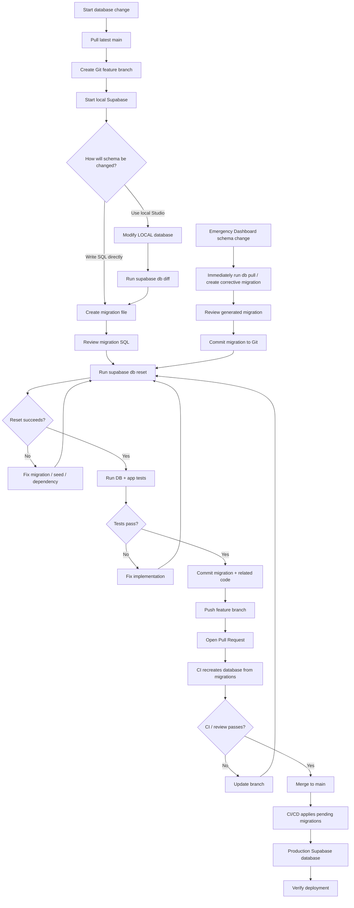
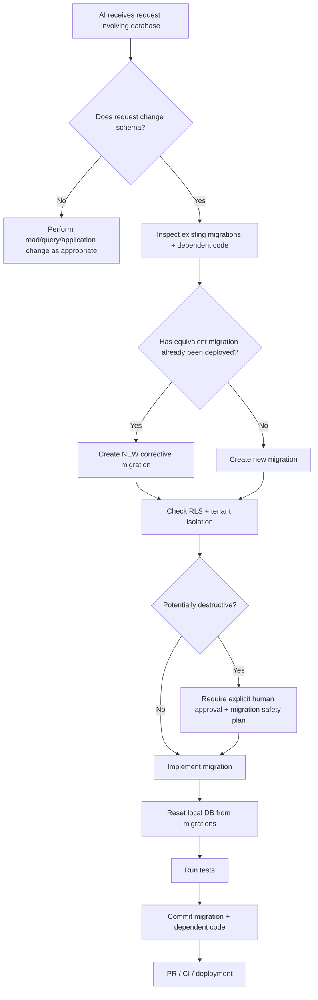

# Supabase Database Development Best Practices

> **Purpose:** Define the canonical development workflow for making, reviewing, testing, and deploying Supabase database changes while keeping the remote database and the repository's `supabase/` directory synchronized.
>
> **Audience:** Human developers, AI coding agents, reviewers, and CI/CD systems.
>
> **Primary rule:** **Git-tracked database migrations are the source of truth for database schema changes.**

---

## 1. Goals

This workflow is designed to ensure that:

- Every database schema change is reproducible.
- The state of the database can be reconstructed from Git.
- Multiple developers or AI agents can safely work on database changes.
- Production is not modified through undocumented manual changes.
- Pull requests show database changes as reviewable SQL.
- Local, preview/staging, and production environments remain aligned.
- Database changes can be tested before deployment.
- Schema drift is detected and corrected deliberately.

---

## 2. Source of Truth

### Canonical source of truth

The canonical database definition is the ordered migration history stored in:

```text
supabase/
└── migrations/
    ├── 20260817120000_initial_schema.sql
    ├── 20260818103000_add_device_status.sql
    └── 20260819141500_add_device_status_index.sql
```

The remote Supabase database is a **deployed instance** of that migration history.

### Rule

```text
Git migrations -> database
```

Do **not** treat this as the normal workflow:

```text
production database -> Git
```

`supabase db pull` is useful for onboarding an existing remote project, recovering changes made through the Dashboard, or resolving drift. It should not be the everyday schema-development workflow.

---

## 3. Recommended Repository Structure

```text
project-root/
├── src/
├── supabase/
│   ├── config.toml
│   ├── migrations/
│   │   ├── <timestamp>_<description>.sql
│   │   └── ...
│   ├── seed.sql
│   ├── functions/
│   └── tests/
├── .env.example
├── package.json
└── README.md
```

### Commit to Git

Commit:

- `supabase/config.toml`
- `supabase/migrations/**`
- `supabase/seed.sql`
- database tests
- Edge Functions
- non-secret project configuration intended to be versioned

### Never commit

Do not commit:

- service-role keys
- database passwords
- access tokens
- production credentials
- `.env` files containing secrets
- generated temporary database files

Use environment variables or Supabase secret-management mechanisms instead.

---

## 4. Recommended Development Model

Supabase supports a local development stack through the Supabase CLI.

The preferred environment hierarchy is:

```text
Local Development
       |
       v
Feature Branch / Pull Request
       |
       v
Preview or Staging Environment
       |
       v
main
       |
       v
Production Supabase Project
```

For small teams, preview/staging can be optional.

The minimum safe workflow is:

```text
Local -> Git branch -> Pull Request -> main -> Production
```

---

## 5. Initial Project Setup

### Install the Supabase CLI

Prefer installing the CLI as a project development dependency so all developers use a controlled version.

```bash
npm install supabase --save-dev
```

Run commands through:

```bash
npx supabase <command>
```

### Initialize Supabase

If the repository does not already contain a Supabase directory:

```bash
npx supabase init
```

This creates:

```text
supabase/config.toml
```

### Link the repository to the hosted project

```bash
npx supabase login
npx supabase link --project-ref <PROJECT_REF>
```

Linking allows CLI commands such as `db pull` and `db push` to interact with the correct Supabase project.

---

## 6. Existing Project: Establishing the Baseline

If the hosted Supabase project existed before migrations were tracked in Git, establish a baseline before normal development begins.

Typical process:

```bash
npx supabase link --project-ref <PROJECT_REF>
npx supabase db pull
```

Review the migration generated by `db pull`.

Then commit it:

```bash
git add supabase/
git commit -m "chore(db): establish Supabase schema baseline"
```

After the baseline exists, future schema changes should normally originate from migrations in Git.

### Important

Do not repeatedly use `db pull` as the normal development workflow.

Its primary purposes are:

- establishing an initial schema baseline
- recovering accidental Dashboard changes
- reconciling schema drift
- inspecting remote changes made by another process

---

## 7. Standard Database Change Workflow

This is the canonical workflow for human developers and AI agents.

### Step 1 — Update local Git

```bash
git checkout main
git pull
```

### Step 2 — Create a feature branch

```bash
git checkout -b feature/add-device-review-status
```

Database changes should be isolated in a feature branch whenever practical.

---

### Step 3 — Start the local Supabase environment

```bash
npx supabase start
```

The local Supabase environment gives developers a disposable database for testing migrations safely.

---

### Step 4 — Make the schema change

There are two supported approaches.

#### Approach A — Migration-first

Create a migration:

```bash
npx supabase migration new add_device_review_status
```

Edit the generated file:

```text
supabase/migrations/<timestamp>_add_device_review_status.sql
```

Example:

```sql
alter table public.device_instances
add column review_status text not null default 'unreviewed';

create index device_instances_review_status_idx
on public.device_instances (review_status);
```

This is the preferred approach for straightforward schema changes.

---

#### Approach B — Local Studio-first

A developer may modify the **local** database through Supabase Studio.

After making the changes locally:

```bash
npx supabase db diff -f add_device_review_status
```

Review the generated migration carefully.

The important distinction is:

```text
GOOD:
Local Supabase Studio -> db diff -> migration -> Git

AVOID:
Production Dashboard -> manual schema change
```

Local Studio is a development interface.

The production Dashboard is not the source-control system.

---

### Step 5 — Rebuild the local database from migrations

Before committing, verify that the database can be recreated from Git:

```bash
npx supabase db reset
```

This is one of the most important checks in the workflow.

`db reset` validates that:

1. migrations execute from the beginning
2. migrations execute in the correct order
3. seed data still works
4. a developer cloning the repository can recreate the expected database state

A migration that works only against the developer's current local database but fails after `db reset` is incomplete.

---

### Step 6 — Run tests

Run applicable:

- database tests
- API tests
- application integration tests
- RLS policy tests
- permission tests
- data migration validation

For security-sensitive tables, test multiple roles.

For example:

```text
anonymous
authenticated user
organization member
organization admin
organization owner
service role
```

---

### Step 7 — Review generated SQL

Before committing a migration, inspect it.

Check for:

- unintended `DROP TABLE`
- unintended `DROP COLUMN`
- data loss
- missing indexes
- missing foreign keys
- incorrect cascades
- RLS changes
- grants or permission changes
- table rewrites on large tables
- long-running locks
- destructive type conversions
- missing rollback or recovery strategy

Never blindly commit the output of `db diff`.

---

### Step 8 — Commit migration and related code together

```bash
git add supabase/migrations
git add src/
git commit -m "feat(db): add device review status"
```

If application code depends on the schema change, prefer putting the application code and migration in the same pull request.

---

### Step 9 — Push the feature branch

```bash
git push -u origin feature/add-device-review-status
```

---

### Step 10 — Open a Pull Request

The Pull Request should explain:

- what changed
- why the schema changed
- affected tables
- whether data is migrated
- whether RLS changed
- whether indexes were added or removed
- deployment risk
- validation performed

The SQL migration is part of the code review.

---

### Step 11 — CI / preview validation

Recommended CI checks:

```bash
npx supabase db reset
```

Then:

```text
database tests
application tests
lint
type checking
integration tests
```

If Supabase Branching is enabled, a Git branch can correspond to a Supabase preview branch.

Preview environments are useful for testing:

- migrations
- API behavior
- RLS
- frontend integration
- Edge Functions
- realistic workflows

before production deployment.

---

### Step 12 — Merge to `main`

Once reviewed:

```text
feature branch
      |
      v
pull request
      |
      v
main
```

`main` represents the migration history intended for production.

---

### Step 13 — Deploy migrations

The preferred production workflow is automated deployment from GitHub or CI/CD.

Conceptually:

```text
main
  |
  v
Supabase deployment
  |
  v
apply pending migrations
  |
  v
production database
```

A manual CLI deployment can use:

```bash
npx supabase db push
```

However, production deployment should ideally be controlled by CI/CD rather than individual developer machines.

---

## 8. Complete Workflow Diagram



---

## 9. Keeping Git and Supabase Synchronized

Think of synchronization as **migration history synchronization**, not continuous two-way file synchronization.

### Expected state

```text
Git migrations
     |
     | applied
     v
Remote migration history
     |
     v
Remote schema
```

All migrations in `main` that are intended for production should eventually be applied to production.

### Before making a change

Always:

```bash
git pull
```

If other developers may have deployed changes outside the expected workflow, inspect migration state before continuing.

### After making a change

Always ensure:

```text
schema change
    +
migration file
    +
Git commit
```

exist together.

A schema change without a migration is drift.

A migration that has never been tested against a clean database is a deployment risk.

---

## 10. Dashboard Change Policy

### Production Dashboard

Treat schema changes through the hosted production Supabase Dashboard as **restricted**.

Avoid using:

- Table Editor to modify production schema
- SQL Editor to perform routine schema development
- Dashboard-only RLS changes
- Dashboard-only function changes

Why:

```text
Dashboard change
      |
      v
Database changes
      |
      X
Git does not know
      |
      v
SCHEMA DRIFT
```

---

### Acceptable Dashboard use

The production Dashboard is appropriate for:

- inspecting records
- viewing logs
- reviewing query performance
- examining schema
- operational troubleshooting
- emergency intervention
- carefully controlled data fixes

Schema changes should still be represented in migrations.

---

## 11. If Someone Changes Production Through the Dashboard

If a production schema change occurs manually:

### Step 1

Stop making additional schema changes.

### Step 2

Pull the remote difference:

```bash
npx supabase db pull
```

### Step 3

Review what was generated.

### Step 4

Ensure the migration accurately represents the intended change.

### Step 5

Test:

```bash
npx supabase db reset
```

### Step 6

Commit the migration.

The goal is to restore:

```text
Git migration history == intended deployed schema history
```

as quickly as possible.

---

## 12. Migration Design Rules

### One logical change per migration

Prefer:

```text
add_device_review_status
add_device_review_status_index
create_device_review_policy
```

over:

```text
misc_database_updates
```

Migration names should explain intent.

---

### Never edit an already-deployed migration

Once a migration has been applied to shared environments:

```text
DO NOT modify it.
```

Create another migration instead.

Bad:

```text
001_create_devices.sql
```

then modifying `001_create_devices.sql` after production deployment.

Good:

```text
001_create_devices.sql
002_add_device_status.sql
003_change_device_status_constraint.sql
```

Migration history should be append-only.

---

### Prefer forward migrations

Production database evolution should normally be:

```text
state N -> state N+1
```

not:

```text
edit history -> hope every environment matches
```

---

### Separate schema migration from large data migration when appropriate

Large production changes may require multiple safe steps.

Example:

```text
Migration 1:
Add nullable column

Deployment:
Application writes old + new fields

Migration 2:
Backfill data

Migration 3:
Add NOT NULL constraint

Deployment:
Application reads new field

Migration 4:
Remove old field
```

This is safer than performing a destructive change in one deployment.

---

## 13. Destructive Change Policy

The following require additional review:

```sql
drop table ...
drop column ...
truncate ...
delete from ... without bounded criteria
alter column ... type ...
drop constraint ...
```

Before destructive changes:

1. identify dependent application code
2. identify dependent database objects
3. determine data-loss impact
4. determine backup/recovery plan
5. verify deployment ordering
6. test against realistic data
7. document the decision in the PR

AI agents must not perform destructive schema changes merely to make tests pass.

---

## 14. Row Level Security Best Practices

Supabase applications often expose Postgres tables through Supabase APIs.

Therefore schema review must include RLS.

For application-facing tables:

```text
table created
    |
    v
RLS enabled
    |
    v
explicit policies created
    |
    v
role behavior tested
```

For multi-tenant applications, every tenant-owned table should be reviewed for tenant isolation.

Questions to ask:

```text
Can Org A read Org B's rows?
Can Org A update Org B's rows?
Can Org A infer Org B's data through a view or function?
Does INSERT enforce organization ownership?
Does DELETE enforce organization ownership?
Does a SECURITY DEFINER function bypass expected restrictions?
```

---

## 15. Seed Data Best Practices

Seed files exist to create reproducible development or test environments.

Use seed data for:

- development users
- sample organizations
- reference data
- representative test projects
- lookup tables
- deterministic test records

Do not put real production customer data into Git.

Seed data should preferably be:

- deterministic
- repeatable
- non-sensitive
- small enough to run quickly

---

## 16. AI Agent Rules

The following instructions are intended to be directly consumable by AI development agents.

### AI_DATABASE_RULES

```yaml
database_workflow:
  source_of_truth: "supabase/migrations"
  remote_database_role: "deployed runtime state"

  before_database_change:
    - pull_latest_git_branch
    - inspect_existing_migrations
    - identify_affected_tables
    - identify_rls_and_permissions
    - identify_application_dependencies

  schema_changes:
    allowed:
      - create_new_migration
      - modify_local_database_then_generate_diff
    discouraged:
      - modify_hosted_production_schema_directly
    forbidden_without_explicit_user_approval:
      - destructive_production_change
      - drop_table
      - drop_column
      - truncate_production_table
      - delete_unbounded_production_data

  migration_rules:
    - one_logical_change_per_migration
    - use_descriptive_migration_names
    - never_edit_already_deployed_migration
    - review_generated_sql
    - commit_migration_with_dependent_code
    - preserve_backward_compatibility_when_possible

  validation:
    required:
      - recreate_database_from_migrations
      - run_seed
      - run_database_tests
      - run_relevant_application_tests
      - inspect_rls_effects
      - inspect_tenant_isolation

  deployment:
    preferred: "CI/CD from main"
    manual_db_push: "fallback or controlled workflow"

  drift:
    definition: "remote schema differs from Git migration history"
    remediation:
      - inspect_remote_change
      - generate_or_pull_migration
      - review_migration
      - test_from_clean_database
      - commit_to_git

  secrets:
    never_commit:
      - service_role_key
      - database_password
      - access_token
      - production_secret
      - populated_dotenv_file
```

---

## 17. AI Decision Tree



---

## 18. Developer Command Reference

### Initialize

```bash
npx supabase init
```

### Authenticate

```bash
npx supabase login
```

### Link remote project

```bash
npx supabase link --project-ref <PROJECT_REF>
```

### Start local stack

```bash
npx supabase start
```

### Stop local stack

```bash
npx supabase stop
```

### Create migration

```bash
npx supabase migration new <migration_name>
```

### Generate migration from local schema changes

```bash
npx supabase db diff -f <migration_name>
```

### Rebuild local database from migrations

```bash
npx supabase db reset
```

### Pull remote schema changes into migration history

```bash
npx supabase db pull
```

Use primarily for:

- initial baseline
- recovery from Dashboard changes
- schema-drift reconciliation

### Apply local migrations to linked remote project

```bash
npx supabase db push
```

Prefer CI/CD for production.

---

## 19. Recommended Git Workflow

```text
main
 |
 +-- feature/add-bom-index
 |
 +-- fix/device-instance-rls
 |
 +-- feature/demarc-routing
```

Each feature branch may contain:

```text
application code
database migrations
database tests
application tests
documentation
```

Pull Requests should represent complete deployable changes whenever possible.

---

## 20. Migration Commit Examples

Good:

```text
feat(db): add device review status
fix(db): enforce tenant isolation on device instances
perf(db): index detections by page and device type
feat(bom): add assembly template relationships
```

Avoid:

```text
database changes
update sql
fix stuff
schema
```

---

## 21. Pull Request Database Checklist

- [ ] Schema changes are represented by new migration files.
- [ ] No previously deployed migration was modified.
- [ ] `supabase db reset` succeeds.
- [ ] Seed data succeeds.
- [ ] Database tests pass.
- [ ] Application tests affected by the change pass.
- [ ] Generated SQL was manually reviewed.
- [ ] RLS policies were reviewed.
- [ ] Multi-tenant isolation was tested where applicable.
- [ ] Appropriate indexes exist.
- [ ] Foreign-key behavior was reviewed.
- [ ] Destructive operations were explicitly reviewed.
- [ ] Data migration requirements were considered.
- [ ] Migration and dependent application code are in the same PR where practical.
- [ ] No credentials or secrets are committed.
- [ ] Deployment order is safe for the currently deployed application.

---

## 22. Recommended Team Policy

### Humans and AI agents SHOULD

```text
Change database locally
        ->
Represent change in migration
        ->
Recreate database from migrations
        ->
Test
        ->
Commit
        ->
Review
        ->
Merge
        ->
Deploy
```

### Humans and AI agents SHOULD NOT

```text
Open production Dashboard
        ->
Change schema
        ->
Forget to update Git
```

That workflow creates drift and makes the production schema impossible to reproduce reliably.

---

## 23. Emergency Production Change Workflow

Sometimes operational incidents require a direct production intervention.

Use:

```text
Incident
   |
   v
Direct production fix
   |
   v
Verify service restored
   |
   v
Capture exact schema change in migration
   |
   v
Test migration from clean local database
   |
   v
Commit + PR
   |
   v
Restore Git as source of truth
```

An emergency change is an exception, not a second development workflow.

---

## 24. Golden Rules

1. **Migration files in Git are the source of truth.**
2. **Develop database changes locally whenever possible.**
3. **Every schema change gets a migration.**
4. **Never silently change production schema.**
5. **Never edit an already-deployed migration.**
6. **Run `supabase db reset` before merging database changes.**
7. **Review generated migration SQL before committing it.**
8. **Test RLS and tenant isolation as part of schema development.**
9. **Commit database migrations with the application code that depends on them.**
10. **Use CI/CD to deploy migrations from `main` to production.**
11. **Treat `db pull` as reconciliation/onboarding, not the normal authoring workflow.**
12. **If remote and Git drift, reconcile immediately.**

---

## 25. Canonical Workflow Summary

```text
git pull
   |
   v
create feature branch
   |
   v
supabase start
   |
   v
create migration
OR
change LOCAL Studio + db diff
   |
   v
review SQL
   |
   v
supabase db reset
   |
   v
run tests
   |
   v
commit migration + code
   |
   v
push branch
   |
   v
pull request
   |
   v
CI / preview environment
   |
   v
merge to main
   |
   v
CI/CD deploys migrations
   |
   v
production
```

---

## 26. References

This guide follows the current Supabase-recommended development model:

- Supabase Local Development Workflow  
  https://supabase.com/docs/guides/local-development/cli-workflows

- Supabase Database Migrations  
  https://supabase.com/docs/guides/local-development/database-migrations

- Supabase Deployment  
  https://supabase.com/docs/guides/deployment

- Supabase Managing Environments  
  https://supabase.com/docs/guides/deployment/managing-environments

- Supabase Branching  
  https://supabase.com/docs/guides/deployment/branching

- Supabase GitHub Integration  
  https://supabase.com/docs/guides/deployment/branching/github-integration

- Supabase CLI  
  https://supabase.com/docs/guides/local-development/cli/getting-started

---

## 27. Instructions for AI Systems Reading This File

When assisting with this repository:

1. Read this document before proposing database changes.
2. Inspect existing files in `supabase/migrations/`.
3. Assume migrations are authoritative unless the user explicitly says the remote database has untracked changes.
4. Create a new migration for schema modifications.
5. Do not modify a migration known to have been deployed.
6. Prefer local development and testing.
7. Explicitly identify RLS, tenant-isolation, data-loss, and deployment-order risks.
8. Never expose or commit secrets.
9. Recommend `supabase db reset` as the clean-state validation step.
10. Keep application code and database migrations synchronized in the same change set.
11. If the remote schema and Git disagree, stop normal schema development and reconcile drift first.
12. Do not instruct a user to make an undocumented production Dashboard schema change as the normal solution.

**When uncertain, preserve data, preserve migration history, and ask whether the target database is local, preview/staging, or production before performing destructive operations.**
